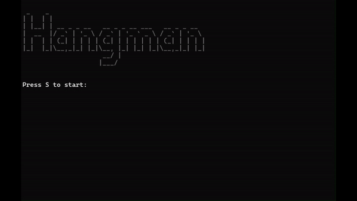

# Lern-Periode 1

23.08.2024 - 20.09.2024

## Grob-Planung  
Ich möchte mein **Programmieren verbessern**. Daher habe ich mir das Ziel gesetzt, ein **Hangman-Spiel in C# zu programmieren**. Der Code soll ein **zufälliges deutsches Wort** auswählen, das anschließend erraten werden muss. Wenn ein Buchstabe richtig geraten wird, erscheint er im Wort. Falls ein falscher Buchstabe geraten wird, wird der Hangman um einen Strich erweitert. Wenn das Wort erraten wird, bevor der Hangman vollständig ist, gewinnt man das Spiel und die Konsole wird geschlossen. Wird der Hangman vervollständigt, verliert man das Spiel und die Konsole wird geschlossen.

## 30.08.2024
- [x] Weitere Planung des Projekts (PAP-Designer)
- [x] Beginnen, den Code zu schreiben, der jeden Buchstaben eines Wortes (zunächst nur eins) als _ anzeigt und beim Erraten eines Buchstabens diesen Buchstaben im Wort einfügt
- [x] "
- [x] "

Heute habe ich eine **.txt-Datei** mit vielen deutschen Wörtern heruntergeladen und mein Programm so erweitert, dass es ein *Wort aus der Liste auswählt* und es in Form von **Unterstrichen** ausgibt. Zudem kann man bereits Buchstaben raten, und die **Unterstriche werden durch die erratenen Buchstaben ersetzt**. Ein Problem ist noch, dass das Programm zwischen **Groß- und Kleinschreibung unterscheidet**, sodass ein richtiger Buchstabe *nicht erkannt wird, wenn er im Lösungswort groß geschrieben ist, aber in der Eingabe klein*.

## 06.09.2024
- [x] Programm so erweitern, dass es nicht mehr zwischen Groß- und Kleinschreibung unterscheidet
- [x] Die verschiedenen Phasen des Hangmans designen
- [x] Diese Phasen in den Code einbauen
- [x] Eventuell zusätzliche Features einbauen (z.B. eine Restart-/Beenden-Option am Ende des Spiels)

Heute habe ich es geschafft, dass das Programm bei der Eingabe eines Buchstabens nicht mehr zwischen Groß- und Kleinschreibung unterscheidet. Außerdem habe ich mithilfe von **ASCII-Art** einen Hangman erstellt und diesen in mein Spiel eingebaut. Auch die Restart-/Beenden-Option am Ende des Spiels konnte ich umsetzen. Zusätzlich habe ich eine Startfunktion eingebaut und das Spiel mithilfe von ASCII-Art optisch verbessert. Außerdem habe ich programmiert, dass das zu erratende Wort im **Game-Over-Menü** angezeigt wird. Das Spiel ist eigentlich so gut wie fertig, dennoch möchte ich in der nächsten Session noch ein paar zusätzliche Features einbauen, z.B. **Sound in das Spiel einfügen** und das Design weiter verbessern.

## 13.09.2024
- [x] Sound in das Spiel einfügen
- [x] Design verbessern
- [x] Eventuell weitere Funktionen einbauen
- [ ] Nach einer neuen Projektidee suchen

Zu Beginn habe ich recherchiert, wie man Töne mit der Konsole ausgeben kann, und bin schnell auf die SoundPlayer-Funktion gestoßen. Anschließend habe ich im Internet nach passenden Tönen für mein Spiel gesucht. Ich wollte nur 8-Bit-Sounds verwenden, darunter eine **Titelmusik**, einen **Ton für den Spielstart**, einen **Ton für richtige Antworten**, einen **Ton für falsche Antworten**, einen **Ton für das Erraten des Wortes** und einen **Ton für den Fall, dass der Hangman vervollständigt wird**. Auf [Pixabay](www.pixabay.com) bin ich fündig geworden und konnte die Sounds *kostenlos* herunterladen. Ich habe die MP3-Dateien anschließend mit [Cloudconvert](www.cloudconvert.com) ins WAV-Format konvertiert. Dann habe ich die WAV-Dateien in den **Debug-Ordner** des Projekts verschoben und im Code eingebaut. Dabei habe ich festgestellt, dass die Konsole nur einen Sound gleichzeitig abspielen kann, aber das war nicht weiter schlimm. Danach habe ich das Farbdesign des Spiels mit `Console.ForegroundColor` angepasst. Nachdem ich das Spiel optisch verbessert hatte, habe ich die Wortliste ebenfalls in den Debug-Ordner verschoben und den Code entsprechend angepasst. Leider bin ich noch nicht dazu gekommen, eine neue Projektidee zu finden.

## 20.09.2024
- [x] Funktion hinzufügen, dass bereits geratene Buchstaben nicht nochmals geraten werden können
- [ ] Nach einer neuen Projektidee suchen

Heute habe ich versucht zu verhindern, dass **bereits geratene Buchstaben nicht nochmals geraten** werden können. Nachdem ich den Code geschrieben hatte, trat beim Starten des Programms ständig eine Fehlermeldung auf, da mein Antivirus das Programm als Virus erkannte. Also habe ich eine neue Projektdatei erstellt und den Code dorthin kopiert – und es hat funktioniert. Anschließend habe ich versucht, eine Funktion einzubauen, die erkennt, wenn mehrere Buchstaben gleichzeitig eingegeben werden, was aktuell noch nicht wie gewünscht funktioniert.

## Fertiges Projekt  
Mein Code ist, wie bereits erwähnt, ein Hangman-Spiel. Ziel ist es, ein Wort zu erraten, indem man vermutet, welche Buchstaben enthalten sind. Wenn man einen Buchstaben rät, der nicht im Wort vorkommt, wird der Hangman erweitert. Die bereits geratenen Buchstaben werden angezeigt. Es ist auch möglich, das ganze Wort zu raten, um schneller zu gewinnen. Gibt man jedoch ein falsches Wort ein, wird der Hangman ebenfalls erweitert. Wird der Hangman vervollständigt, verliert man das Spiel. Errät man das Wort vorher, gewinnt man. Anschließend kann man das Spiel neu starten.

## Reflexion  
Diese Lernperiode hat mir geholfen, viele neue Dinge über C# zu lernen und bereits Bekanntes besser anzuwenden. Ich habe z.B. gelernt, wie und wann man bestimmte *Loops* verwendet, wie man *Arrays und Indizes* nutzt, wie man if, else if und else anwendet und sogar, wie man *Sound in ein Programm einfügt* (mit dem .NET-Framework). Auch mit *Funktionen* habe ich mich beschäftigt. Zudem habe ich gelernt, wie man *ASCII-Art in der Konsole ausgibt*. Ich habe festgestellt, wie wichtig die Grundlagen sind, um komplexere Programme zu schreiben, und wie viel man bereits mit den Basics programmieren kann. In der nächsten Lernperiode möchte ich meinen Variablen unbedingt sinnvollere Namen geben, um **den Überblick im Code nicht zu verlieren**. Es wäre auch sinnvoll, künftig **Kommentare im Code** zu hinterlassen. Ich habe außerdem bemerkt, dass mir Programmieren viel mehr Spaß macht, wenn ich gefordert werde. Daher werde ich auch in der nächsten Lernperiode vermutlich versuchen, etwas Komplexeres zu programmieren.
